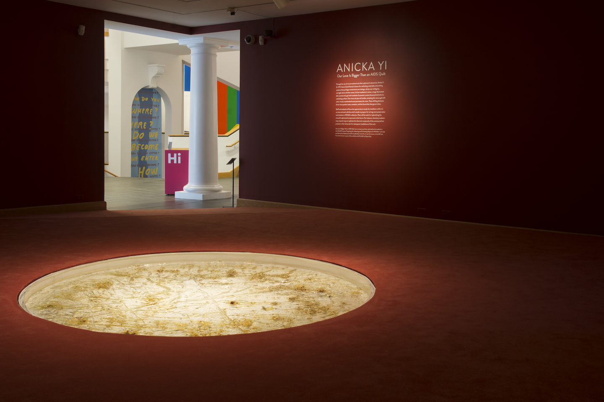
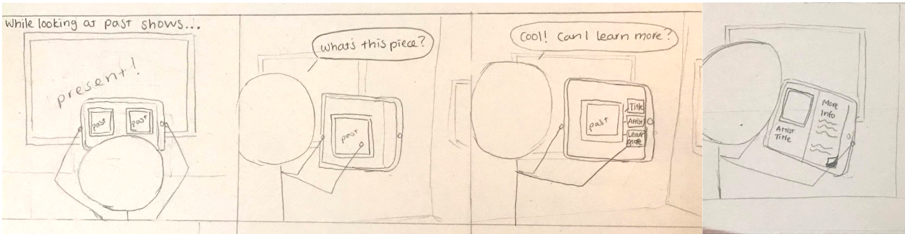
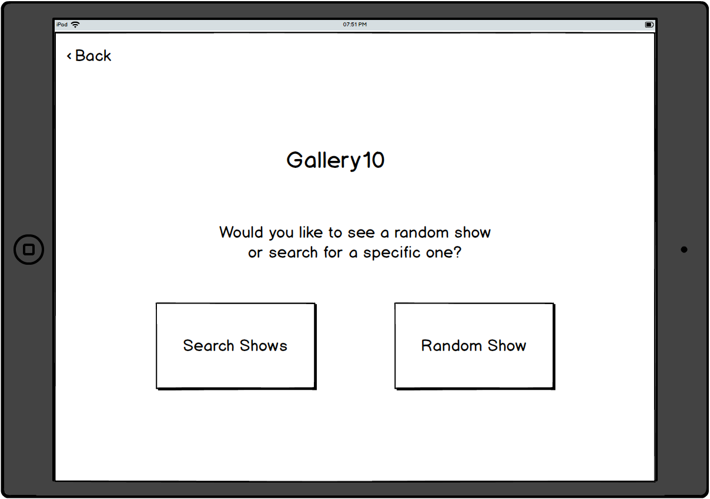

Creating a good design requires the careful consideration of both the user and the design itself. In my following manifesto, I will describe what I have learned to consider to be the 5 most significant aspects of a “good design”, reflecting on the lessons and experiences from this course in which they were especially exemplified. I believe it is important to create things. More than that, though, I believe it is important to create things not just for the sake of creating them, but to better the world and people’s experiences with it.

## 1. Good design satisfies a need ##

A good design should be motivated by a real problem and **the only way to know whether or not people care about a problem is to actually talk to people.** We spent a significant portion of the semester “looking to understand”, meaning that before we even began to prototype or envision our design, we took numerous steps to talk to our target users and learn about them.

*A gallery at the Williams College Museum of Art (WCMA) where we began to research our user. Image from [WCMA](https://wcma.williams.edu)*

We began this project with only a brief fly-on-the-wall observation at WCMA and from that came up with a problem we wanted to approach. We then conducted a series of contextual inquiries at the museum in which we had participants complete two tasks related to learning more about their current space. Participants were asked to ‘think out loud’, explaining to us all of their actions and the reasonings behind them. (More details on our contextual inquiry and project-specific findings can be found [here](https://omondieric.github.io/whereYouArt/contextualReview)). We did all this to see how people actually behaved in the space in which we wanted our design to function. We got to know our target user, learning about their behavior, things they liked, things they didn't, and more.

## 2. Good design is functional ##

This may seem obvious, that **a good design is one that works.** But throughout our design process, it was apparent that it can be easy to overlook edge cases especially with unpredictable human users and when translating from an abstract concept to the actual design.

One of the ways we ensured a high level of functionality in our design was by mapping out task flows. These allowed us to see how a user might progress through our design, the logical connections between our different wireframes. We analyzed our design from the perspective of a user both trying to accomplish a given task and also just logically navigating through. It is important to consider both the tasks we want to provide for the user and also the user’s expectations of functionality. The design should be robust to any possible actions a user wants or expects to be able to do. As much as the design is our own creation, we still need to provide for the user’s wants and expectations.

*One of the storyboards we created to help us better visualize how users might use our design and to engage more deeply with these use cases.*

On a lower level, good design should have good usability heuristics. In this course, the first time we actually created our designs and brought our ideas to life was in the form of a paper prototype. All the groups brought their paper prototypes to class to be tested through heuristic evaluations and as soon as we began to use each other’s designs, we quickly realized that none of our designs included “Back” buttons. In our first attempts to translate our designs from abstract concepts to something tangible and interactive, we had all neglected a small, but functionally necessary component.
(Read more about our heuristic evaluation and the lessons we learned in greater detail [here](https://omondieric.github.io/whereYouArt/heuristic_eval))

## 3. Good design is accessible ##

Good design should be inclusive. **Regardless of your target or intended user, your design should be accessible to users with a range of abilities.** This means specific details, like ensuring all of your images have descriptive alt text and checking that a screen reader can logically navigate your structure, and more high-level ones like having a simple and consistent layout without large, heavy blocks of text. We were introduced to a poster series on the “Dos and don’ts of designing for accessibility” by the U.K. government that I found incredibly helpful. The graphics are both compelling and memorable. For the many small details that can sometimes be overlooked when actually creating a design, these are posters to which I will continue to refer.

*"Dos and don'ts of designing for accessibility from [UK Gov](https://accessibility.blog.gov.uk/2016/09/02/dos-and-donts-on-designing-for-accessibility/)*

Overall, **accessibility in your design helps everyone.** Not having massive blocks of text makes it more readable and interesting for everyone. Making buttons descriptive and large allows everyone to navigate your design more easily. We cannot exclude users simply because they have different abilities than us, after all one of the most repeated sentiments of this course has been that the user is not like us. We are all just temporarily able-bodied. A good design must be accessible.

## 4. Good design is ethical ##

Users of your design, although we sometimes talk about them in abstract ways or view them as type groups, are most importantly people and need to be treated as such with respect for them as individuals and for their data.

We had the opportunity in this course to examine a few moments in which companies failed to consider their users or workers as human individuals and created unethical designs or acted in unethical ways. One of these cases involved the company Strava, a fitness data service. Strava publicly shared data on the activity of their fitness-tracker wearing users that not only could be linked to individual users, but also revealed the locations of US military and intelligence operations. If data on individuals is made publicly available, it should not be personally identifiable. And even if users give consent, it is the responsibility of the company releasing it to deeply consider the implications of providing such data to the public. (Read the article from Wired in full [here](https://www.wired.com/story/strava-heat-map-military-bases-fitness-trackers-privacy/))

While it can be helpful to look at these cases and consider the mistakes that were made and what should have been done, I find it more constructive to think in terms actions that I can take, rather than just instances to avoid. Although “The Signal Code: A Human Rights Approach to Information During Crisis” from the Harvard Humanitarian Initiative was created for the context of disasters, I found its key points generally applicable and very resonant. Namely that all people have the right to privacy, security and control over their individual data.

> "All people have a right to have their personal information treated in ways consistent with internationally accepted legal, ethical, and technical standards of individual privacy and data protection" - from "The Signal Code"

Users place an amount of trust in the companies whose technologies they choose to use. Companies need to respect their users and this trust. **People should be able to control how their data is collected, used, or disclosed. And have the right to change their mind on any of that at any point in time.**

## 5. Good design is delightful ##

A good design should not frustrate the user; rather, the user should enjoy their experience with the design. While it is impossible to completely guarantee that every individual will have a positive experience, there are steps we can take to test

We had the opportunity this semester to talk to professionals currently working in industry on UX design and UX research. One of these individuals was Chloe Fan, a project designer for Uber. On her website, Chloe states: “I design beautiful, everyday experiences that help people make the most out of their lives.” I found this statement incredibly compelling and had the opportunity to ask if she could expand upon what she meant by “beautiful”. In her explanation, she said that **“beautiful design” should bring the user delight.**

One way we incorporated this sense of "delight" in our design was providing users with the option to explore. We include a "Random" option for selecting a past show to view in AR to allow users to just explore and maybe learn something new.

During our contextual inquiries, we noticed that users really enjoyed when they made new discoveries. While on the Wikipedia page for the Williams College Museum of Art, one of our participants came across a page on the "Williams Art Mafia". Another of our participants learned the story behind a local artist and his sculpture that she passes every day. Although the actual concept of our design changed significantly during the design process from what it was during the contextual inquiries, we held on to those small moments, knowing that the spark of excitement we saw in our participants was one we wanted to cultivate in users of our design.

Good design satisfies a need, is functional, is accessible, is ethical, and is delightful. Good design considers the user at every moment. It is the product of a thorough study of its target users; it is shaped by user wants and expectations; it functions to serve the user, of any range of ability, both providing them the promised service and, hopefully, a moment of delight.
