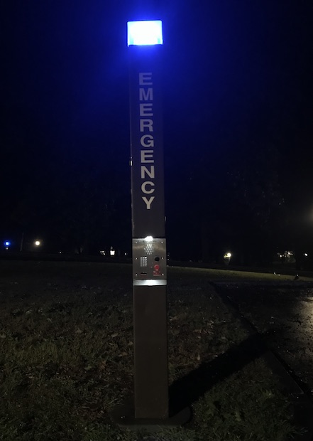

These emergency lights are distributed across the Williams campus, in addition to many college campuses across the United States. Every backwards-walking guide will explain during their segment on Safety and Security that if someone ever felt unsafe walking around, they could hit the button on the light and help would rapidly arrive.

The lights provide their users (who may simply be viewers) with a sense of safety as both symbolic and also very functional objects.

**The blue light** placed high at its very top, cuts through the darkness, a color incredibly distinct from any other light, similar only, perhaps, to those of a police car. Their sight is a comforting reminder to anyone walking at night that help is present, should they need it. And, should someone need it, the light is a bright signal marking its location.

**The button panel** has appropriately few features. In the case of an emergency, the most important function the light serves is to allow the user to quickly and easily call for help. On the lit panel, the help button is clearly labelled and is a distinct red.

Thankfully I have never needed, and hope to never need, to use one of these emergency lights. However, walking home from the library late at night, it is comforting to look out and see a scattering of bright, blue lights mixed amongst the streetlights. And it is a comfort to know that should I ever need to use one to call for help, I already understand exactly what I'd need to do.

(images taken myself Sept 10, 2018)
